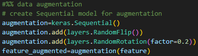
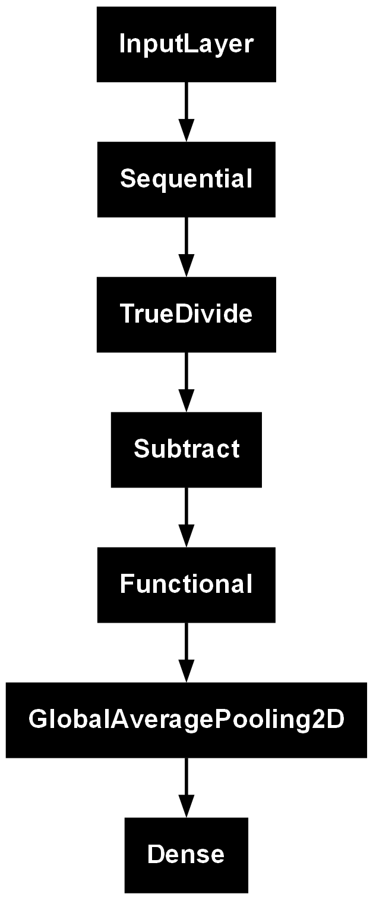
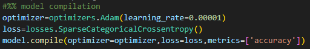
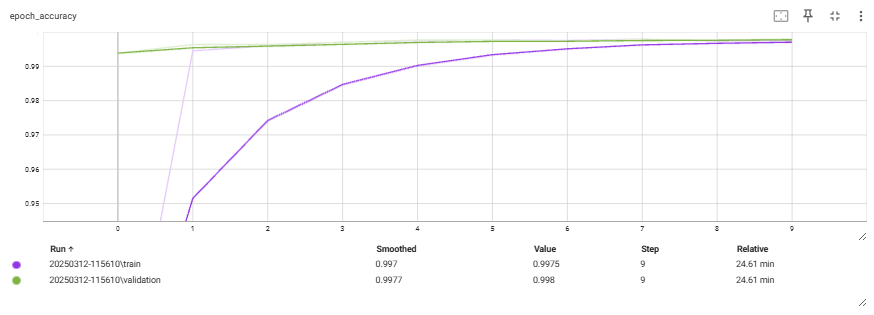
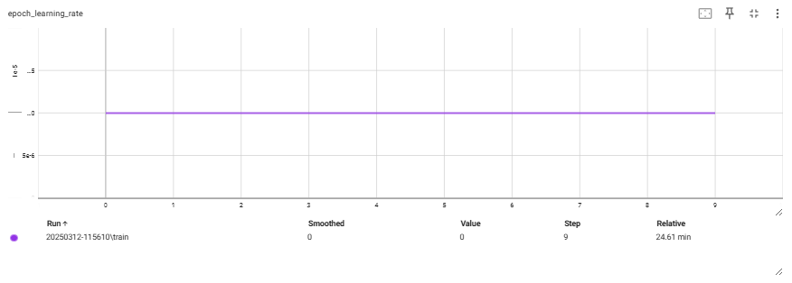
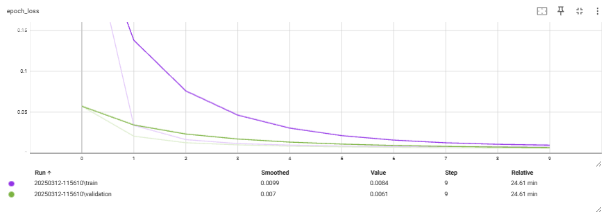
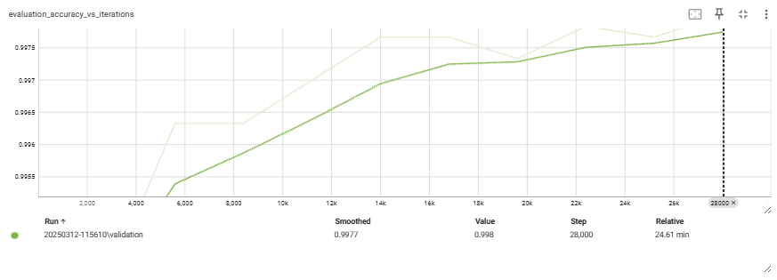
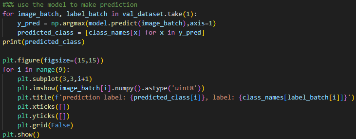

# Concrete Crack Classification using Transfer Learning

This project exploits a deep learning model for the classification of concrete crack images. MobileNetV2 architecture is used for transfer learning and various techniques such as data augmentation, early stopping, and TensorBoard are applied for training and evaluation.

## Project Overview

The goal of this project is to develop a deep learning model that can classify images of concrete cracks into categories ('Positive' or 'Negative'). The model is based on the MobileNetV2 architecture, which is pre-trained on ImageNet and used for feature extraction. The model is further fine-tuned to classify concrete cracks. The steps Involved:

1. **Data Preprocessing**: Load and preprocess the dataset for training.
2. **Data Augmentation**: Apply transformations such as random flips and rotations to increase the diversity of the dataset.
3. **Transfer Learning**: Use a pre-trained MobileNetV2 model to extract features, then fine-tune it for our task.
4. **Model Training**: Train the model with early stopping and TensorBoard for visualization.
5. **Model Evaluation**: Evaluate the model's performance on a test dataset.
6. **Prediction**: Make predictions on new images.

## Libraries

Libraries used:
- TensorFlow
- Keras
- NumPy
- OpenCV
- Matplotlib

## Dataset

The data is loaded using Keras and the dataset is split into training, validation, and test sets. Data is taken from the data source:

[Data Source](https://data.mendeley.com/datasets/5y9wdsg2zt/2)

## Data Augmentation

Data augmentation is applied to increase the variety of the dataset. This includes random rotations and flips. The augmented images are used to train the model.

## Model Architecture

The model uses MobileNetV2, pre-trained on ImageNet, as the base feature extractor. Freeze technique is applied on the weights of the pre-trained layers to retain learned features and prevent overfitting. The model is then further customized with a Global Average Pooling layer and a dense output layer for classification.

## Model Training

The model is compiled using the Adam optimizer and the SparseCategoricalCrossentropy loss function. The usage of Callbacks TensorBoard aims for visualization purposes and EarlyStopping is used to prevent overfitting.

The training occurs in two stages. In the second stage, the base model is unfreezed and fine-tuned.

## Evaluation

After training, the model is evaluated using the test dataset to check its performance:

## Prediction

The trained model can be used to make predictions

